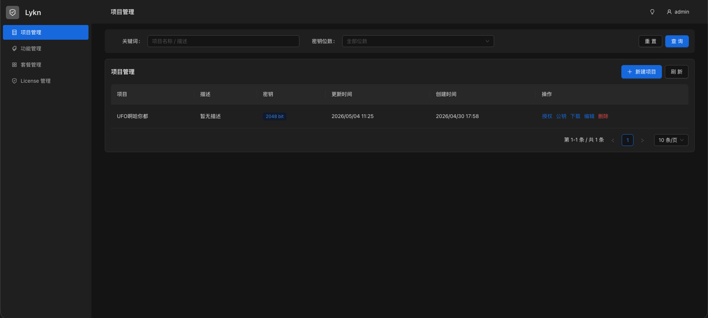

# Lykn

跨语言项目授权平台。管理 license 的签发与验证。



## 项目结构

- `api/`、`cmd/`、`config/`、`database/`、`internal/`、`pkg/` — Go 管理平台主应用
- `sdk/python/` — Python 验证 SDK
- `sdk/go/` — Go 验证 SDK
- `frontend/` — 前端（Antdv Next）

## 主应用开发

1. 复制 `config/config.yaml.example` 为 `config/config.yaml`
2. 启动 PostgreSQL，或使用 `docker compose up postgres`
3. 在仓库根目录运行 `make run`
4. 默认用户：`admin / admin123`（仅开发环境，启动后请立即修改）

常用命令：

```bash
make help
make test
make build
make demo
```

`make demo` 会重新生成跨语言测试 fixture：`tests/fixtures/public.pem`、`tests/fixtures/license.lic` 和完整的 `tests/fixtures/license.json`。

## Frontend 开发

1. 复制 `frontend/.env.example` 为 `frontend/.env`
2. 进入 `frontend/` 目录运行 `pnpm dev`
3. `frontend/.env` 必须提供 `VITE_API_BASE`，代码不会为该变量设置默认值；跨域由后端 CORS 处理

## Docker Compose

Docker Compose 会同时启动前端、后端和 PostgreSQL。前端由 Nginx 容器提供页面，并把 `/api/` 请求反向代理到 Go 后端。

```bash
zsh -ic 'proxy; docker compose up -d --build'
```

如果 Docker Hub 与 npm 访问稳定，也可以直接运行：

```bash
docker compose up -d --build
docker compose logs -f server
docker compose down -v
```

默认服务：

- `postgres`：`postgres:16`
- `server`：Go API 服务，仅在 Compose 网络内监听 `8080`
- `frontend`：Nginx 前端服务，监听 `http://127.0.0.1:8080`

本地 `make run` 使用 `config/config.yaml`。Compose 使用 `config/config.compose.yaml`，后端所有配置都从 YAML 读取。
